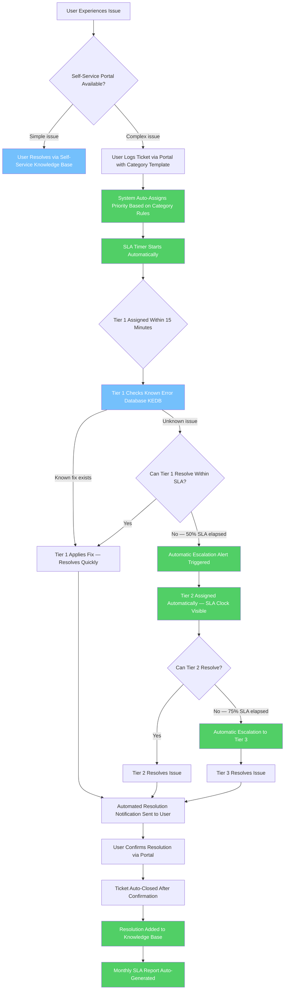

# Future State Workflow — After Optimisation

> This diagram represents the improved IT service desk process.
> Key improvements are annotated inline.

## Incident Ticket Lifecycle — Future State

## Key Improvements Implemented

| Improvement | Problem Solved | Expected Outcome |
|---|---|---|
| Self-service knowledge base portal | Reduces Tier 1 volume by handling simple issues | 25% reduction in ticket volume |
| Automated priority assignment via category rules | Eliminates manual misclassification | High priority breach rate drops from 67% to under 30% |
| SLA timer starts at ticket creation | No SLA visibility in current state | Agents always aware of time remaining |
| Automatic escalation at 50% SLA elapsed | Email escalation caused delays and lost tickets | Escalation time reduced from hours to minutes |
| Known Error Database integrated at Tier 1 | Recurring issues solved from scratch each time | Repeat incident resolution time reduced by 40% |
| Automated user provisioning via AD role templates | Access tickets taking 30+ hours | Access ticket resolution under 2 hours |
| Auto-generated monthly SLA reports | No reporting visibility in current state | Management has real-time performance data |
