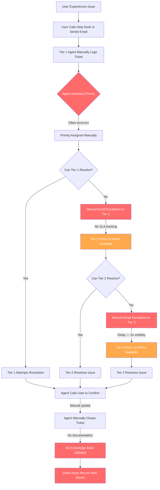

# Current State Workflow — Before Optimisation

> This diagram represents the existing IT service desk process.
> Key problems are annotated inline.

## Incident Ticket Lifecycle — Current State

## Key Problems Identified

| Problem | Impact |
|---|---|
| Manual priority assignment with no standard criteria | High priority tickets misclassified — SLA breached |
| Escalation via email only — no tracking | Tickets lost or delayed between tiers |
| No SLA visibility during ticket lifecycle | Agents unaware when SLA is about to breach |
| No Known Error Database | Same issues resolved repeatedly from scratch |
| Manual ticket closure process | Tickets left open — inaccurate reporting |
| No user self-service option | All issues routed through Tier 1 regardless of complexity |
